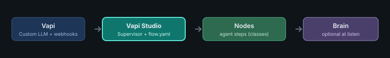
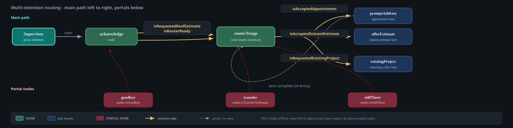

# Vapi Studio

**[@guidify-ai/vapi-studio](https://github.com/guidify-ai/vapi-studio)** — a **code-driven toolkit for [Vapi](https://vapi.ai)**.

**Self-hosted and Dockerized.** You run the NestJS app and Postgres (and any other services you add) on **your** infrastructure — laptop via Docker Compose, or your own cloud/VPS. There is no Guidify-hosted runtime and no managed SaaS for the conversation engine. Vapi stays the voice channel in the cloud; your Studio app is the Custom LLM + webhook endpoint Vapi calls.

<p align="center">
  
</p>

This repository ships NestJS libraries at the **repo root** (`src/`, `@guidify-ai/vapi-studio`). Your bots live in **`projects/`** in the same clone — no `packages/` layer, no second repository required. Example apps are **Docker Compose–first**: the supported way to run a call stack is `yarn start` (Compose build/up + optional ngrok for local Vapi HTTPS), not a long-lived host-machine Node process for the app.

```text
vapi-studio/
├── src/                  ← framework
├── docs/
├── projects/             ← your NestJS apps (`file:../..`)
│   └── my-voice-app/
└── package.json
```

Project **content** under `projects/` is gitignored by default; `projects/README.md`, `projects/.gitignore`, and the tracked Vapi Studio sample **`projects/sample-landing-llm/`** (`:9998` — `/analytics`, `/flow`, `/studio`, Vapi routes) are included. Marketing landing (`:4173`) and other private apps stay gitignored.

New tools will appear here as they are built. Documentation for how to use them lives under [`docs/`](./docs/README.md).

---

## Tools

| # | Tool | Status | Summary |
| --- | --- | --- | --- |
| 1 | **Deterministic Assistant for Vapi** | Shipped | Typed agent steps + `flow.yaml` paths. Supervisor routes each turn; Brain interprets speech only at listen boundaries — it does not own the graph. |

More tools may be added later. Each gets its own section here when shipped.

**Deterministic Assistant** — start at [Introduction](./docs/getting-started/introduction.md) · [Concepts](./docs/guide/concepts.md) · [Runtime API](./docs/reference/runtime-api.md).

---

## How it fits with Vapi

Vapi Studio assistants are **Custom LLM + webhook** endpoints — fully compatible with ordinary Vapi assistants. You choose how much of the call graph lives in Studio:

| # | Mode | When to use |
| --- | --- | --- |
| 1 | **Single-assistant flow** | New bots. One Vapi assistant; the complex conversation graph lives in Vapi Studio (`flow.yaml` + nodes). Lane jumps use `continueTo` — no Squad required. |
| 2 | **Multi-assistant Squad** | Several Studio-backed assistants in one Vapi Squad. Studio `handoff` switches members while keeping one Conversation. See [Workflow & Squad](./docs/guide/workflow-squad.md). |
| 3 | **Inject into an existing Squad** | Drop Studio assistants into Squads you already run in Vapi. They speak the same Custom LLM / tool / handoff contracts as native members, so you can mix Studio and non-Studio assistants. |

Most greenfield work starts with **(1)**. Use **(2)** when you want separate Vapi assistants per lane. Use **(3)** when Studio owns only part of a larger Squad.

---

## How multi-intention routing works

One listen can surface **several competing intentions**. The flow chart reads **left to right** on the main path; lane branches stack with space to breathe; **portal nodes** sit on a row **below** so edges and labels do not cross node text.

<p align="center">
  
</p>

**Supervisor** — framework component that picks the next agent step each turn (scores intentions, checks portal nodes, then follows `flow.yaml`).

| Shape | Meaning |
| --- | --- |
| **NODE** | Agent step on the main path — speaks, listens, writes memory; one node may expose many outbound intentions |
| **PORTAL NODE** | Same agent-step shape with `portal: true` in `flow.yaml` — global interrupt (goodbye, transfer, still-there, …) |
| **INTENTION** | Routing signal on an edge (app-defined or `studio.is*`) — multiple edges can share a target |

Solid arrows = main path and intention routes. Dashed arrows = portal-node interrupts or lane re-entry loops.

**Layout convention:** main conversation path **left → right**; lane branches get vertical space; **portal nodes** on a row **below** the main path (so labels and edges stay readable). Example apps should use the same layout in Flow Studio (`/flow`). Future **call replay** can highlight visited nodes and dim the rest.

Example apps render the full interactive graph at **`/flow`** (Flow Studio).

---

## References

| What | Where |
| --- | --- |
| **Documentation** | [`docs/README.md`](./docs/README.md) — install, guides, building apps |
| **Best practices** | [`docs/best-practices/`](./docs/best-practices/) — conversation doctrine (one CTA, PII, forensics) |
| **Agent-first RAD** | [`agent/AGENTS.md`](./agent/AGENTS.md) · postinstall → `.cursor/rules/vapi-studio-best-practices.mdc` · [Agents & Cursor](./docs/guides/agents.md) |
| **Runtime API** | [`docs/reference/runtime-api.md`](./docs/reference/runtime-api.md) — shipped contracts (update with code changes) |
| **Example apps** | [`docs/building-apps/example-apps.md`](./docs/building-apps/example-apps.md) · [`projects/`](./projects/README.md) |

---

## Install & run

### Deployment model

| Piece | Where it runs |
| --- | --- |
| **Vapi** (telephony, ASR/TTS, assistant config) | Vapi cloud |
| **Your Studio app** (Supervisor, nodes, Brain, webhooks) | **Self-hosted** — Docker Compose locally, or containers/VM you operate |
| **Postgres** (conversations, events) | **Self-hosted** beside the app (Compose `db` service by default) |

Local and production alike: ship the app as **containers**. Host Node/Yarn is for **framework build and scaffolding** (`yarn build`, `yarn new-project`); the live call process is Docker.

### Requirements

| Layer | Tools |
| --- | --- |
| **Framework** (repo root) | **Node.js 22+**, **Yarn 1.x** (build / test / scaffold) |
| **App runtime** (in `projects/<name>/`) | **Docker** + **Docker Compose** |
| **Local Vapi calls** | **[ngrok](https://ngrok.com/download)** on your PATH, Vapi account |

Vapi runs in the cloud and must call your machine over **HTTPS**. Local dev uses **ngrok** to tunnel the Docker-published port (example apps use **9999**) to a public URL. `yarn start` in a project starts **Docker Compose** **and** ngrok, writes `PUBLIC_BASE_URL` to `.env`, and prints the Webhook + Conversation links below.

### 1. Clone and build

```bash
git clone git@github.com:guidify-ai/vapi-studio.git
cd vapi-studio
yarn install
yarn build    # framework → dist/
yarn test     # optional verify
```

### 2. Add your project

```bash
yarn new-project   # interactive name + slug → projects/<slug>/ + project.identity.json
```

Bots live in **`projects/`** — no second repo, no sibling folder:

```text
vapi-studio/
├── src/                  ← framework
└── projects/
    └── my-voice-app/     ← your NestJS app
```

```json
// projects/my-voice-app/package.json
{
  "dependencies": {
    "@guidify-ai/vapi-studio": "file:../.."
  }
}
```

```bash
cd projects/my-voice-app
yarn install   # first time, or after you change dependencies
yarn start     # Docker Compose (app + Postgres) + ngrok; prints Vapi-ready URLs
```

**Wire into Vapi** — `yarn start` prints an HTTPS origin (ngrok) and two URLs to paste into your Vapi assistant:

| Vapi assistant setting | Endpoint |
| --- | --- |
| **Webhook** | `{PUBLIC_BASE_URL}/{PROJECT_UUID}/vapi/webhook` |
| **Conversation** (Custom LLM) | `{PUBLIC_BASE_URL}/{PROJECT_UUID}/vapi/chat/completions` |

`PUBLIC_BASE_URL` is the ngrok HTTPS origin (new each time ngrok restarts unless you use a reserved domain). Example apps use `scripts/start.sh` (invoked by `yarn start`) — **Compose up --build**, health check, ngrok tunnel, then the link block above. For non-local deploys, point the same Vapi URLs at your self-hosted HTTPS origin and run the same Docker image/stack without ngrok.

Before the first call, wire `VapiStudioModule`, `config/flow.yaml`, and Vapi HTTP routes in the project. See [`projects/README.md`](./projects/README.md) · [Creating an app](./docs/building-apps/creating-an-app.md) · [Installation](./docs/getting-started/installation.md).

After framework changes: `yarn build` at the repo root, then reinstall in the project if needed.

---

## License

[MIT](./LICENSE)
